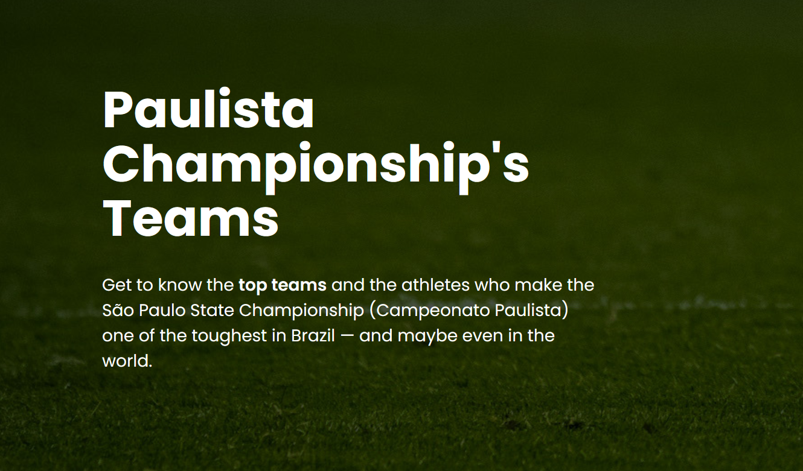

# Vue Ajax

**Objective:** 
Build a website utilizing a frontend framework that can connect to a custom Lumen API.



## About
This project integrates a Vue.js frontend with a Lumen-based API to showcase major football clubs from the Paulista Championship. Using Vue components and JavaScript's Fetch API, dynamic data from the backend is rendered to the website.

The site features four football clubs, each with its own set of details and player information. Users can interact with each team to explore unique stats and content for that club.

## Team
Jenifer Quelali
Rodrigo Nascimento

## Installation

1. **Install Composer:** https://getcomposer.org/

2. **Clone this repository:**
```bash
    git clone https://github.com/rodrigonn2/JQRN_Vue_ajax.git
```

3. **Access this project in your terminal and run:** 
```bash
   cd install composer
   ```
4. **Open a local server and you are good to go!** 

## Technologies Used
1. Vue.js
2. AJAX (Fetch API)
3. HTML, SCSS
4. PHP (Lumen)
5. GSAP

## History
April 2025

## Prototype
https://www.figma.com/design/RJ8qdbyx8Pac2GQIBUdqUO/PAULISTA_SOCCER?node-id=35-108&t=VNzMhbN2QBwbqdjZ-0


